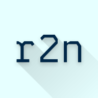
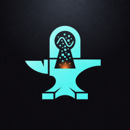
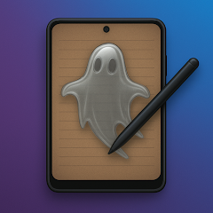
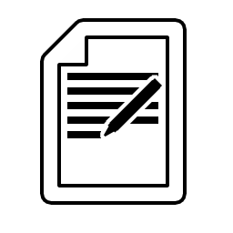
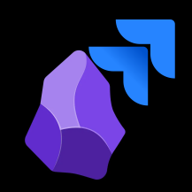
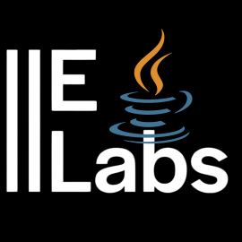
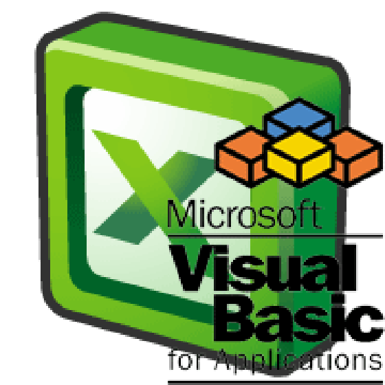
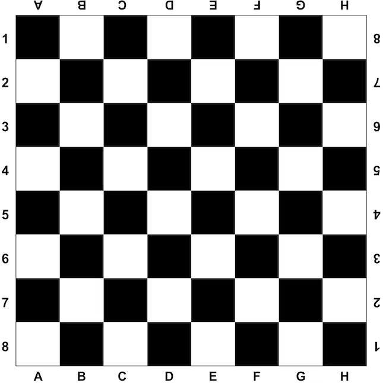

<!-- ASCII LOGO: KENDİNE GÖRE DOLDUR -->
<pre>
                                 ░██       ░██                       ░█████████ 
                                         ░██                       ░██    ░██ 
░██░████ ░██    ░██  ░███████  ░██ ░████████  ░███████  ░██    ░██       ░██  
░███     ░██    ░██ ░██    ░██ ░██░██    ░██ ░██    ░██  ░██  ░██       ░██   
░██       ░██  ░██  ░██    ░██ ░██░██    ░██ ░█████████   ░█████       ░██    
░██        ░██░██   ░██    ░██ ░██░██   ░███ ░██         ░██  ░██      ░██    
░██         ░███     ░███████  ░██ ░█████░██  ░███████  ░██    ░██     ░██    
                                                                              
</pre>

  
  
  
  
  
  
  
  
  
  
  
  
  
  
  

### **Cross-platform developer** on a mission to create seamless, elegant, and accessible software experiences — with a side quest for gaming 

  
  

## Free & Open Source Software

| | | |
| :---: | :--- | :--- |
| <a href="https://github.com/rvoidex7/repo2notebook">  <a/> | **[repo2notebook](https://github.com/rvoidex7/repo2notebook)** Convert any code repository into a single markdown file for NotebookLM and other LLM tools. | MVP Completed |
| <a href="https://github.com/rvoidex7/repo2notebook">  <a/> | **[entropy-forge](https://github.com/rvoidex7/entropy-forge)** Pluggable entropy framework for cryptographic applications with built-in quality testing, visualization, and interactive educational tools. | MVP Completed |
| <a href="https://github.com/rvoidex7/floating-ghost-image">  <a/> | **[floating-ghost-image](https://github.com/rvoidex7/floating-ghost-image)** Android app that displays images as a semi-transparent floating overlay. | MVP Completed |
| <a href="https://github.com/rvoidex7/Labrune">  <a/> | **[Labrune](https://github.com/rvoidex7/Labrune)** The Language Editor for NFS Games!  | MVP Completed |
| <a href="https://github.com/rvoidex7/jira-obsidian-sync">  <a/> | **[jira-obsidian-sync](https://github.com/rvoidex7/jira-obsidian-sync)** Rust-based, Synchronizes between the Obsidian Kanban plugin and Jira Kanban | MVP Completed |
| <a href="https://github.com/rvoidex7/java-elabs-tts">  <a/> | **[java-elabs-tts](https://github.com/rvoidex7/java-elabs-tts)** Java-based Text-to-Speech (ElevenLabs) conversion system. | MVP Completed |
| <a href="https://github.com/rvoidex7/excel-toplam-makro">  <a/> | **[excel-toplam-makro](https://github.com/rvoidex7/excel-toplam-makro)** It performs a sum across rows in Excel (by date) | MVP Completed |
| <a href="https://github.com/rvoidex7/SatrancNotasyon" >  <a/> | **[SatrancNotasyon](https://github.com/rvoidex7/SatrancNotasyon)** You can practice chess notation | MVP Completed |
| ⬜ | **[julesctl](https://github.com/rvoidex7/julesctl)** | Active Dev |
| ⬜ | **[web-intelligence-rs](https://github.com/rvoidex7/web-intelligence-rs)** | Active Dev |
| ⬜ | **[cli-chat-rs](https://github.com/rvoidex7/cli-chat-rs)** | Active Dev |
| ⬜ | **[ats-cv-Create](https://github.com/rvoidex7/ats-cv-Create)** | Active Dev |
| ⬜ | **[r7notes](https://github.com/rvoidex7/r7notes)** | Active Dev |
|| <h3 align="center"> [All Repositories](https://rvoidex7.github.io/r7notes/Projects/All-Repositories) <h3/> ||

## 🎮 Games I Actually Play

  
  
  
  
  
  
  

  <picture>
  <source media="(prefers-color-scheme: dark)" srcset="https://raw.githubusercontent.com/rvoidex7/rvoidex7/output/pacman-contribution-graph-dark.svg">
  <source media="(prefers-color-scheme: light)" srcset="https://raw.githubusercontent.com/rvoidex7/rvoidex7/output/pacman-contribution-graph.svg">
  
</picture>

<!--

--> 
